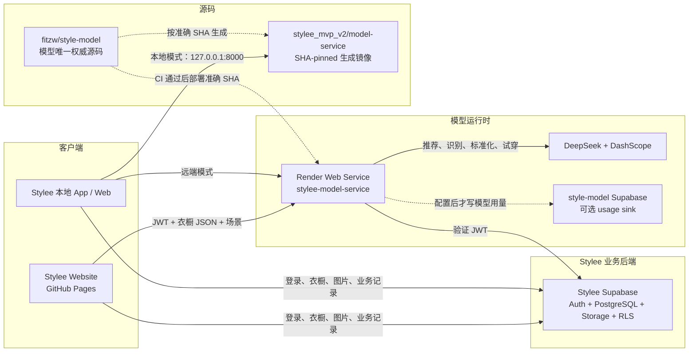

# Stylee 运行架构、模型服务与发布规则

> 状态：已核验的当前架构说明
> 最近核验：2026-08-20（Asia/Singapore）
> 适用仓库：`yiguo2026/stylee_mvp_v2`、`fitzw/style-model`

## 1. 本文解决什么问题

Stylee 同时存在 App 仓库内的 `model-service/`、独立的
`fitzw/style-model` 仓库、Render 线上实例，以及两个用途不同的
Supabase 项目。它们曾经依赖人工同步，容易出现“本地看到的是新能力，线上运行的仍是旧代码”
的误判。

本文固定以下内容：

- 本地和线上分别如何生成穿搭推荐；
- Stylee App、`style-model`、Render 和两个 Supabase 的职责；
- 当前生产环境实际运行的版本；
- 唯一源码、部署、镜像同步和验证的标准顺序；
- 当前缺口、风险和处理优先级。

本文不记录任何 API key、Deploy Hook、用户密码、Access Token 或其他 Secret。

## 2. 一句话结论

线上 Stylee Website 是静态前端，不运行 App 仓库里的 Python `model-service/`。
它把 Stylee Supabase JWT、衣橱 JSON、天气和场景发送给 Render；Render 当前从
`fitzw/style-model:main` 构建并调用 DeepSeek / DashScope。

App 仓库里的 `model-service/` 只用于一体化本地联调和测试，目标状态是从
`style-model` 的明确 Git SHA 自动生成，不能再独立修改。

## 3. 当前运行拓扑



## 4. 线上 Website 如何做穿搭推荐

当前 Website 发布自 App commit：

```text
61180961e600c14396547c0268b743e6c32f03d2
```

线上 bundle 固定使用：

```text
EXPO_PUBLIC_STYLEE_API=https://stylee-model-service.onrender.com
EXPO_PUBLIC_SUPABASE_URL=https://pdgocqjvncxkwfrcdhtj.supabase.co
```

实际链路：

1. 用户通过 Stylee Supabase Auth 登录。
2. App 从 Stylee Supabase 读取 `wardrobe_items`、用户资料和风格偏好。
3. App 在设备本地扣减一次推荐额度。
4. App 发送 `POST /recommend`，请求包含：
   - Supabase access token；
   - 活跃衣橱单品及真实 `item_id`；
   - 天气、城市、场景、风格标签；
   - 期望返回套数。
5. Render 用 Stylee Supabase `/auth/v1/user` 验证 JWT，不直接查询业务表。
6. 模型服务执行 B0-B6 推荐流程。
7. App 将返回的真实 `owned_item_ids` 映射回衣橱单品，将缺失项显示为推荐补齐。
8. App 直接排版已有透明单品图；搭配画布不调用生图模型。
9. 只有用户点击“就这么穿”或收藏时，结果才写回 Stylee Supabase。

2026-08-19 的真实线上测试确认：

- Website 成功调用 `model-service/deepseek`；
- 空衣橱返回上装、下装和鞋三件推荐补齐；
- 页面耗时约 8.4 秒；
- 未保存搭配、未修改衣橱。

## 5. 本地拉取 Stylee 后如何推荐

### 5.1 只启动 Expo

```bash
npm install
npx expo start --web
```

如果没有配置 `EXPO_PUBLIC_STYLEE_API`，客户端默认访问：

```text
http://127.0.0.1:8000
```

Expo 不会自动启动 Python 模型服务。如果 8000 端口没有服务，App 会进入本地
fallback / mock。页面能出现搭配不代表正在使用真实模型。

### 5.2 启动 App 内镜像服务

另开终端，配置本地忽略的 `.env` 后运行：

```bash
cd model-service
python3 serve.py --provider deepseek
```

这时 App 调用本地 `model-service/` 镜像。该镜像必须与 canonical SHA 对齐；
它不是另一套可独立开发的模型源码。

### 5.3 本地前端调用线上 Render

设置：

```text
EXPO_PUBLIC_STYLEE_API=https://stylee-model-service.onrender.com
```

此时界面在本机运行，但模型行为与线上 Website 一样，由 Render 决定。

### 5.4 Demo 不等于模型推荐

`/outfit-layout-demo` 仅验证透明单品图、尺寸和编辑式布局，不会调用
`POST /recommend`，也不能用于判断 Render 或 prompt 是否已更新。

## 6. 推荐服务内部流程

```text
B0  DeepSeek 解析自然语言意图
B1  代码生成满足天气、场景和槽位要求的候选池
B2  Garments2Look RAG 检索审美范例
B3  DeepSeek 从候选池生成多套候选
B4  代码执行硬校验和评分
B5  去重、排序和多样性选择
B6  返回推荐理由、置信度和 trace
```

约束不是只写在 prompt 中：

- `stylee/providers/openai_compat.py::build_gen_messages()`：给模型的 system prompt；
- `stylee/constraints.py`：真实 ID、身体覆盖、鞋/包/帽数量等硬校验；
- `stylee/outfit_policy.py`：绝对规则和可被用户需求覆盖的默认规则；
- `stylee/pipeline.py`：首轮生成、定向重试、确定性安全兜底。

如果第一轮没有合法候选，服务只再生成一次并携带稳定违规错误码；仍失败则返回
经过绝对规则复检的确定性 fallback。

## 7. 两个仓库的职责

### 7.1 `fitzw/style-model`

目标中的唯一权威来源，负责：

- Python 模型运行代码；
- 推荐约束和 prompt；
- 视觉识别、透明标准化、试穿；
- 测试、Dockerfile、`render.yaml`；
- Garments2Look RAG 数据和 manifest；
- CI、Render 精确 SHA 部署和线上 smoke。

### 7.2 `yiguo2026/stylee_mvp_v2`

负责：

- Expo / React Native 客户端；
- Stylee Supabase业务读写；
- 页面、状态管理、透明单品画布；
- GitHub Pages 和原生 App 发布；
- `model-service/` 的生成式、SHA-pinned 本地镜像。

模型行为必须先改 canonical，再同步 App 镜像。禁止先改 App 镜像再“顺手”补
`style-model`。

## 8. Render 当前已核实事实

2026-08-20 通过 Render Dashboard 只读核验：

| 项目 | 当前值 |
|---|---|
| Workspace | 当前 Stylee Render workspace |
| Service | `stylee-model-service` |
| Service type | Docker Web Service，Free，Oregon |
| Public URL | `https://stylee-model-service.onrender.com` |
| Service source | `fitzw/style-model` |
| Service branch | `main` |
| Root Directory | 空，使用仓库根目录 |
| Dockerfile | `./Dockerfile` |
| Docker build context | `.` |
| Auto-Deploy | Off |
| Health Check | `/health` |
| PR Previews | Off |
| Deployment mode | canonical `main` CI 通过后，由 GitHub Actions 调用 Render Deploy Hook 发布准确 SHA |
| 当前线上 commit | `04fd52406ab8a7beb814ea0258eff57a9d4fbf2d` |
| 当前 commit 时间 | 2026-08-20 |

### 8.1 Blueprint 控制面已暂停并对齐 main

2026-08-20 核验时发现：服务自身连接 `fitzw/style-model:main`，但 Blueprint
仍指向过期分支 `codex/model-service-security`，并且 Auto Sync 为 Yes。这会让旧分支
的 `render.yaml` 在未来同步时覆盖 Dashboard 中的配置。

已按“先停止自动同步，再改分支”的顺序完成控制面修正：

```text
Blueprint Auto Sync: No
Blueprint Branch: main
Blueprint Path: render.yaml
```

保存分支后，Render 曾为 `main@0f19c8e` 生成一个未审批的旧 Blueprint sync 预览。
该预览不能再审批，因为生产已通过 Deploy Hook 发布更晚的准确 SHA；如仍需要
Blueprint 同步，必须在当前 `main` 上重新生成并重新审核预览。

### 8.2 当前线上已与 canonical main 对齐

`style-model/main` 当前为：

```text
04fd52406ab8a7beb814ea0258eff57a9d4fbf2d
```

Render `/health` 返回同一个 SHA。以下能力现已进入生产：

- 新的穿搭约束 prompt；
- 绝对约束、定向重试和确定性 fallback；
- 透明 PNG 主图及加强后的抠图质检；
- Garments2Look 3000 条向量索引；
- 准确 SHA 发布、健康检查和真实 provider smoke；
- 当前 DashScope 上海结果域名的精确白名单支持。

### 8.3 当前线上 RAG 状态

Render `/health` 当前返回：

```text
artifact_available=true
signature=openai_compat:text-embedding-v4:1024
dim=1024
count=3000
```

发布后的认证 smoke 已确认 `recognize-multi`、`standardize`、`recommend` 和
`tryon-image` 均返回 200；推荐不再因为缺失索引而固定退回 6 条关键词范例。

### 8.4 当前 Render 环境变量

Dashboard 中存在以下变量名称，值保持隐藏：

```text
DASHSCOPE_API_KEY
DEEPSEEK_API_KEY
LLM_MAX_TOKENS
STYLEE_ALLOWED_ORIGINS
STYLEE_PROVIDER
STYLEE_RATE_LIMIT_PER_MINUTE
STYLEE_REQUIRE_AUTH
SUPABASE_PUBLISHABLE_KEY
SUPABASE_URL
VL_MULTI_MODEL
```

未配置：

```text
STYLEE_SUPABASE_URL
STYLEE_SUPABASE_KEY
```

因此线上模型调用的 usage 当前只打印到 Render 日志，不写入 style-model 的
Supabase。

## 9. 两个 Supabase 的职责

### 9.1 Stylee Supabase

核心生产依赖，负责：

- Supabase Auth；
- 用户资料和风格偏好；
- 衣橱、搭配、收藏、心愿单、穿着记录；
- 衣物图片和身体照片 Storage；
- RLS；
- App 行为埋点、反馈和账号删除请求。

Render 只使用它验证 access token，不使用 service-role key，也不直接读取业务表。
衣橱数据由 App 按用户权限读取后，通过请求 JSON 发送给 Render。

2026-08-20 已恢复并只读核验 Dashboard 管理权限：

| 项目 | 当前状态 |
|---|---|
| Organization | `Stylee Group`，Free plan，1 个项目 |
| Project | `Stylee MVP`，Healthy，Seoul `ap-northeast-2`，nano |
| Auth users | 约 70 个 |
| Email Auth | Enabled |
| New signups | Enabled |
| Confirm email | Off |
| Publishable key | 存在可用的 modern publishable key；值不进入本文 |
| Storage | 私有 `body-photos`；公开 `wardrobe-images` |
| Migration history | Dashboard 显示 No migrations |
| Scheduled backups | Free plan下显示 No backups |
| GitHub integration | No repository connected |

当前权限足以管理 Auth 用户、API Keys、Storage 和数据库。发布前仍需创建一个密码已知、
仅用于自动 smoke 的专用用户，并把凭证直接存入 GitHub Secrets；凭证不得进入聊天、
文档或 Git。

### 9.2 style-model Supabase

它不是模型运行依赖，也不保存衣橱。设计上只存：

- provider / model / feature；
- token、图片数、耗时和估算成本；
- 成功/失败和 request ID。

2026-08-20 通过独立 Supabase 连接器确认：该项目名为
`fitzw's 260708-usage-monitor`，位于独立 Free organization，项目状态为
`INACTIVE`。这解释了项目域名的 TLS/连接失败。

当前结论：

- Render 没有配置对应环境变量，线上服务不写入；
- 旧前端 `aiUsage.ts` 没有实际调用点；
- 项目当前 `INACTIVE`，表与 migration 元数据也无法正常读取；
- 现有 SQL 允许匿名读取 `ai_usage_logs`，还包含 `user_id`、`dev_tag`、
  `request_id`，不适合继续作为生产权限模型。

若保留该项目，应改成仅服务端写、受控后台读，并将变量重命名为
`STYLEE_USAGE_SUPABASE_URL` / `STYLEE_USAGE_SUPABASE_KEY`，避免与 Stylee Auth
Supabase 混淆。

## 10. 当前版本漂移快照

| 层 | 当前 SHA / 状态 | 是否线上生效 |
|---|---|---|
| Stylee App main | `61180961` | Website 已生效 |
| style-model main | `04fd5240` | 已部署到 Render |
| Render production | `04fd5240` | 当前线上模型版本 |
| canonical 发布链路 | PR #9、#10、#11 均已合并 | 已生效 |
| App 镜像治理 PR | #18，`codex/stylee-feedback-fixes` | Draft，待同步提交 |
| App 本地 `UPSTREAM_COMMIT` | `04fd5240` | 已生成，待推送 PR #18 |

当前 canonical 与 Render 已对齐；App 内镜像也已从同一 SHA 生成，但在 PR #18 合并前，
App `main` 仍不包含这套镜像治理和最终 pin。

### 10.1 GitHub Actions Secret 门槛

2026-08-20 只读列名核验：

- `fitzw/style-model` 已有 `RENDER_DEPLOY_HOOK_URL`；
- `fitzw/style-model` 已有 `STYLEE_SMOKE_SUPABASE_URL`、
  `STYLEE_SMOKE_SUPABASE_ANON_KEY`、`STYLEE_SMOKE_EMAIL` 和
  `STYLEE_SMOKE_PASSWORD`；
- `yiguo2026/stylee_mvp_v2` 已有 `STYLE_MODEL_READ_TOKEN`；
- App 仓库中的历史客户端模型 key 和 Supabase service key 已于 2026-08-20 删除；
  必要的 Web、部署和镜像读取 Secrets 保持不变。

### 10.2 历史 Key 指纹核验

2026-08-20 采用 SHA-256 指纹比对，过程中不记录或输出明文：

| Key | 核验结论 |
|---|---|
| DeepSeek | Render 当前生产 Key 与 Git 历史硬编码 Key 指纹不同；用户确认历史 Key 已注销 |
| DashScope | Render 当前为 116 字符的新格式；用户确认历史客户端 Key 已注销 |
| Supabase legacy `service_role` | 当前项目 Key 与 Git 历史客户端硬编码值指纹完全相同，确认仍是当时暴露值 |

当前线上 bundle 已不包含上述高权限 Key，但历史公开客户端、Git 记录或缓存不能撤回，
因此 Supabase legacy `service_role` 必须按已泄露凭证处理。DeepSeek 当前生产 Key 不应
因旧事件被无依据地重复轮换。DeepSeek 和 DashScope 的“旧 Key 已注销”来自用户确认；
当前 Render Key 指纹和 Git 历史指纹的比对属于独立技术核验。

2026-08-20 已完成 Web 客户端迁移：App GitHub Secret
`EXPO_PUBLIC_SUPABASE_ANON_KEY` 已替换为 modern `sb_publishable_...` key，并通过
GitHub Action `32339498524` 重新发布。新 gh-pages commit 为 `be7c96c5`；新 bundle
包含 1 个 modern publishable key、0 个 legacy JWT、0 个 service-role/secret key。
实际登录、衣橱读取和 `model-service/deepseek` 推荐均成功，且当前没有需兼容的
iOS/Android 安装包。因此可以进入 Supabase legacy keys 的最终停用步骤。

随后已在 Dashboard 停用 legacy `anon` / `service_role` API keys，并完成带对照组的
Data REST 验证：无 Key、legacy anon、legacy service_role 均返回 401，modern
publishable key 返回 200。停用后 Website 登录态和衣橱读取继续正常；Dashboard
提供 Re-enable 入口，可在发现遗漏消费者时恢复。

### 10.3 本次 canonical 发布证据

- PR #9 引入单一源码、RAG、准确 SHA 发布和镜像治理基础，merge SHA 为 `70ade224`；
- PR #10 修复 release smoke CLI 的直接执行路径，merge SHA 为 `734952e4`；
- PR #11 精确允许线上实际返回的 DashScope 图片域名，merge SHA 为 `04fd5240`；
- `main` CI run `32358053607` 成功；
- Render deploy run `32358099238` 成功，并验证线上 SHA 为 `04fd5240`；
- 认证 smoke：auth、recognize-multi、standardize、recommend、tryon-image 均为 200；
- `tryon-image` request ID 为 `release-smoke-tryon-image`，耗时约 19.1 秒。
- App 镜像治理同时纳管 `fixtures/release-smoke/`，防止测试被同步但测试素材缺失。

## 11. 当前主要问题

### P0：当前发布阻断项

1. App PR #18 仍需完成最终镜像验证、提交和 CI；在此之前不能合并 App PR。
2. 旧的 `0f19c8e` Blueprint sync 预览不能误点 Approve。

### P1：剩余交付与运行风险

1. App `main` 尚未包含最终 SHA-pinned 镜像；本地镜像已生成，等待 PR #18 更新。
2. Render Free 实例休眠，冷启动仍可能额外增加 50 秒以上。

### P2：长期工程和数据治理

1. 本地只启动 Expo 会静默回落 mock，容易把假结果当真模型。
2. 推荐次数保存在客户端 AsyncStorage，可被清理，跨设备也不一致；失败请求仍会扣次。
3. Supabase migrations 不足以从零复建完整生产 schema；代码引用的部分表没有对应迁移。
4. style-model 用量库的匿名读取权限过宽。
5. App 根目录本地 `main` 曾出现明显 ahead/behind，不应作为远端 main 的替代来源。

## 12. 解决顺序

### 阶段 A：先修发布控制面，不部署业务代码

1. **已完成**：记录 Render 当前服务设置和环境变量名称，未导出 Secret。
2. **已完成**：关闭 Blueprint Auto Sync，并把 Blueprint 分支改为 `main`；未审批
   sync、未部署。
3. **已完成**：Deploy Hook 已成功发布 `04fd5240` 到现有 `stylee-model-service`。
4. **已完成**：Stylee Supabase 管理权限、专用 smoke 用户，以及 URL、publishable
   key、邮箱和密码四个 GitHub Secrets 均已完成。
5. **待决策**：状态为 `INACTIVE` 的 style-model Supabase 是恢复、替换还是停用。
6. **已完成 P0 安全项**：按 `docs/security/model-api-incident-response.md` 核验历史
   客户端模型 key 和 Supabase service-role/secret key。指纹核验已经确认 DeepSeek
   当前生产 Key 不同、Supabase legacy `service_role` 仍相同；用户确认 DeepSeek 和
   DashScope 历史 Key 已注销。App 的 legacy anon key 已迁移为 modern publishable
   key并完成 Web 重新发布和真实验证；Supabase legacy keys 已停用且通过 401/200
   对照验证；App 仓库中的三个历史高权限 Secret 已删除。

### 阶段 B：发布 canonical

1. **已完成**：PR #9、CLI hotfix PR #10、图片域名 hotfix PR #11 均已合并。
2. **已完成**：四个 Stylee Supabase smoke Secret 已配置并通过真实调用。
3. **已完成**：canonical `main` 当前为 `04fd5240`。
4. **已完成**：main CI 通过后，Deploy Hook 发布同一 Git SHA。
5. **已完成**：`/health` 同时满足：
   - `git_sha` 等于刚合并 SHA；
   - `repo_slug=fitzw/style-model`；
   - contract version 正确；
   - RAG artifact 可用且 count=3000。
6. **已完成**：真实认证 smoke 覆盖识别、标准化、推荐和试穿。

### 阶段 C：生成并发布 App 镜像

1. **已完成（本地）**：从已部署 canonical SHA `04fd5240` 生成 `model-service/`。
2. **已完成（本地）**：`model-service/UPSTREAM_COMMIT` 已更新为该部署 SHA。
3. **已完成（本地）**：严格同步检查、两套模型测试、72 个 App 测试、TypeScript/设计检查和 Web build 均通过。
4. **待完成**：更新 PR #18；用户审核后再合并。
5. **待完成**：App 发布后再做一次真实端到端验证。

### 阶段 D：清理长期债务

1. 删除未使用的前端 `aiUsage.ts` 和硬编码监控项目。
2. 将推荐额度迁移到服务端权威存储。
3. 把完整数据库 schema 转成顺序明确、可重复执行的 migrations。
4. 提供明确的本地运行模式：`mock`、`local-real`、`remote-production`。
5. 评估将 Render 升为常驻实例，降低冷启动失败。

## 13. 以后模型能力更新的固定规则

```text
1. 只在 fitzw/style-model 创建模型改动
2. 新增/更新离线测试和 RAG manifest
3. canonical PR CI 全绿
4. 合并 canonical main
5. 部署该准确 SHA 到 Render
6. /health + 真实 provider smoke 通过
7. 从该 SHA 生成 Stylee model-service 镜像
8. 更新 UPSTREAM_COMMIT
9. App CI 验证镜像一致性
10. 合并并发布 App
```

禁止：

- 同时手工修改两份模型源码；
- 先改 App 镜像、后补 canonical；
- 只看 GitHub main 就宣称线上已更新；
- 只看 Website UI 就判断 Render prompt 已更新；
- 在无法确认 SHA/RAG 的情况下合并后直接宣称完成；
- 把 Deploy Hook、provider key、Supabase 密码或 service-role key 写入 Git。

## 14. 每次发布的交付证据

每次模型发布至少记录：

- canonical PR 和 merge SHA；
- canonical CI 结果；
- Render deploy SHA；
- `/health` 的 repo、branch、SHA、contract 和 RAG 状态；
- 真实 provider smoke 的成功结果和 request ID；
- Stylee `UPSTREAM_COMMIT`；
- App PR、CI 和 Website 发布 SHA；
- 尚未解决的人工配置项。

## 15. 证据来源

- Render Dashboard：Service、Settings、Environment、Blueprint、Deploy history、Logs；
- `fitzw/style-model` 当前 main 和发布候选分支；
- `yiguo2026/stylee_mvp_v2` 当前 main 和 App 镜像治理分支；
- `docs/model-workflow-validation-2026-08-05.md`；
- `docs/superpowers/specs/2026-08-18-style-model-release-pipeline-design.md`；
- 当前 Website bundle 与真实线上推荐测试。
