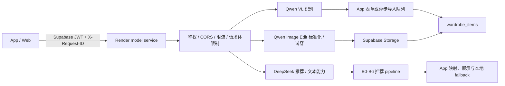

# 模型 Workflow 稳定性修复与线上验证记录（2026-08-05，更新至 2026-08-07）

本文记录 2026-08-04～07 对 Stylee 模型链路进行的实际代码审计、线上复现、Render 日志归因、修复和回归验证。
结论来自真实页面、真实模型请求和运行日志，不以架构说明文档代替验证，也不描述模型不可见的内部思维链。

## 1. 结论摘要

| 链路 | 当前结论 | 证据等级 |
|---|---|---|
| 穿搭推荐 `/recommend` | 已确认根因、修复并在线上真实请求中恢复 | 已实测 |
| 请求追踪与超时归因 | App、model service 和上游模型元数据已可按 request ID 对齐 | 代码与测试已验证 |
| 手动添加/编辑的识别失败保护 | 失败结果不会覆盖表单或已有商品属性 | 代码与单测已验证 |
| 主入口“相册导入”的识别失败保护 | 失败、mock 或 degraded 结果不会进入标准化和自动入库 | 代码、单测与失败请求已验证 |
| 真实图片识别 | 白底衬衫正确识别为 `web`，服务端 6.670 秒返回 | 线上端到端已实测 |
| 图片标准化 | `web/product` 商品图直接保留原图；其他照片才请求 `/standardize` | 代码、单测与线上日志已验证 |
| 推荐 RAG | Render 缺少向量索引，线上持续降级为关键词检索 | 线上日志已确认，P1 |

因此，准确的发布结论是：**推荐与识别主链路的本轮稳定性修复均已验证；白底商品图的识别和标准化旁路已在线上跑通。非商品图标准化的长耗时、Render 免费实例冷启动和 RAG 索引缺失仍是后续风险。**

## 2. 验证对象与版本

### 2.1 App/Web 仓库

- 仓库：[`yiguo2026/stylee_mvp_v2`](https://github.com/yiguo2026/stylee_mvp_v2)
- 分支：`main`
- 本轮功能修复后的基线：`2b4d560`
- 线上页面：`https://yiguo2026.github.io/`
- App 内 vendored model service：`model-service/`

### 2.2 线上 model service

- Render 实际部署源：[`fitzw/style-model`](https://github.com/fitzw/style-model)
- 本轮部署版本：`c2bf5d4`
- 服务地址：`https://stylee-model-service.onrender.com`
- App 仓库中的 `model-service/` 不是 Render 的直接部署源；服务端改动必须同步到两个仓库并执行同步检查。

### 2.3 本轮证据

- 登录后的线上 Web 页面真实操作。
- 浏览器网络状态、控制台错误与页面耗时。
- Render Application Logs 中的 `stylee_request`、`stylee_upstream_response` 和 usage 日志。
- App、model service 当前代码的逐入口调用追踪。
- model service 离线测试、App 契约测试、`npm run check`、Web 构建和 vendored service 同步检查。

## 3. 当前真实架构链路



### 3.1 识别与相册导入

主入口“相册导入”的实际路径是：

1. `AddClothingSheet` 选择一张或多张图片，调用 `importStore.startImport()`。
2. `importStore.handleDetection()` 调用 `aiDetectMultiItems()`。
3. `aiDetectMultiItems()` 请求 `/recognize-multi`：
   - App 等待上限 60 秒；
   - model service 上游等待上限 50 秒；
   - 模型为 `qwen3-vl-flash`；
   - 单图视觉输入通过 `VL_MULTI_MAX_PIXELS=1048576` 限制解析像素，配置值同时写入 request trace。
4. 仅当服务端明确返回 404/501、表示旧部署不支持 `/recognize-multi` 时，客户端才兼容性回退到 `/recognize`。504、502、网络失败或客户端超时不会再串行等待第二个模型请求。
5. service 失败、mock 响应或 `trace.degraded=true` 时，结果统一标记为不可信；`importStore.handleDetection()` 通过 `acceptedRecognitionItems()` 丢弃这些结果并将任务置为失败。
6. 只有可信且非空的识别结果才进入确认、标准化、上传和 `addItem()`。

因此，原始“多品识别失败后再等单品识别，最后把随机 mock 属性自动入库”的链路已经关闭。mock 仍可用于无状态演示，但不能进入衣橱持久化路径。

手动添加页和编辑页的路径不同：两处已通过 `shouldApplyRecognition(meta.ok, itemCount)` 拦截失败结果；手动添加还必须由用户点击保存后才写库。

### 3.2 图片标准化

1. 识别结果的 `photo_type` 为 `web/product` 时，App 直接使用原图，不请求 `/standardize`，也不增加 2.2 秒展示等待。
2. `flatlay/on_body/angled` 等其他照片仍请求 `/standardize`，App 整体等待上限 90 秒。
3. model service 顺序执行 Qwen Image Edit，默认上限 60 秒；生成后再执行 Qwen VL 视觉回验，默认上限 20 秒。
4. 回验成功后，App 将上游临时图片复制到 Supabase Storage。
5. 标准化失败时，导入队列回退到原图，并记录 `standardization=fallback_original`；商品图旁路记录 `standardization=skipped_web`。

该 fallback 可以保证导入可用，但必须建立在识别属性可信的前提上；不能与随机 mock 属性组合后自动入库。

### 3.3 穿搭推荐

1. 结果页读取用户衣橱、风格偏好、天气、文本或筛选标签。
2. App 请求 `/recommend`，客户端等待上限 90 秒。
3. model service 执行鉴权、限流并创建 request trace。
4. 推荐 pipeline 顺序执行：
   - B0：DeepSeek 解析自然语言意图；
   - B1：代码构造季节、槽位和衣橱候选池；
   - B2：检索 Garments2Look 审美范例；
   - B3：DeepSeek 生成候选搭配；
   - B4：代码做硬约束校验和四维评分；
   - B5：代码去重并保证多样性；
   - B6：代码生成置信度。
5. App 将 service 响应映射到衣橱单品并展示。
6. service 失败时：
   - 空或稀疏衣橱使用 `buildFallbackLook()`；
   - 其他情况使用本地 mock 推荐；
   - request ID、失败阶段和错误类型会保留在错误元信息中。

推荐额度目前在发起模型请求前由客户端 `AsyncStorage` 扣除，因此 service 失败后展示 fallback 仍会消耗一次额度。这是当前已确认但未修复的产品/计费语义问题。

### 3.4 试穿与 Gamma

- 生产试穿同时请求 `/tryon-image` 和 `/tryon-suggestion`：Qwen Image Edit 生成图片，DeepSeek 生成建议。
- App 的试穿图请求上限为 120 秒；试穿额度同样在请求前由客户端扣除。
- Gamma 是独立实验路径：`/gamma/import`、`/gamma/outfit`、`/gamma/tryon`，不替代上述生产链路。

## 4. 推荐失败的真实归因

### 4.1 首次页面现象

- 首次真实页面测试中，`/recommend` 约 69 秒后返回 500，页面约 83 秒展示本地 fallback。
- 当时尚未部署分阶段 trace，69 秒可能同时包含 Render 冷启动、服务执行和页面 fallback 等待，不能仅凭该数字判断是“模型慢”还是“请求超时”。
- 该次请求只能证明 service 最终失败，不能提供足够的阶段归因。

### 4.2 加入 trace 后的复现

加入 request ID 和阶段耗时后，线上又复现两次 502：

| 请求 | 总耗时 | B0 | B3 | 失败阶段 | 错误 |
|---|---:|---:|---:|---|---|
| 复现 1 | 21.239 秒 | 4.826 秒 | 15.689 秒 | `B3.generate_outfits` | `JSONDecodeError` |
| 复现 2 | 16.041 秒 | 1.809 秒 | 14.232 秒 | `B3.generate_outfits` | `JSONDecodeError` |

第三次复现的完整上游证据：

| 字段 | 值 |
|---|---:|
| request ID | `stylee-msene5x8-8ams9r8k` |
| HTTP 状态 | 502 |
| service 总耗时 | 20.998 秒 |
| B0 | 2.107 秒 |
| B3 | 18.250 秒 |
| `finish_reason` | `length` |
| 正文长度 | 0 字符 |
| 推理内容长度 | 6901 字符 |
| completion tokens | 2048 |
| 最终错误 | `JSONDecodeError: Expecting value: line 1 column 1` |

### 4.3 根因

这不是网络超时，也不是 60 秒服务端 deadline 被触发。真实执行过程是：

1. DeepSeek 的 B3 HTTP 请求成功返回。
2. 请求未显式关闭 thinking，模型把 2048 个输出 token 全部用于推理内容。
3. `finish_reason=length`，可供业务解析的 `message.content` 为空。
4. provider 对空字符串执行 JSON 解析，在第一个字符失败。
5. model service 将该异常归因为 B3 的 502；App 随后展示本地 fallback。

长耗时主要来自 B0、B3 两次串行模型调用，其中失败请求的 B3 单次占 14～18 秒。增加客户端超时只能让用户等得更久，不能解决空正文问题。

## 5. 已实施改动

### 5.1 App/Web 仓库提交

| Commit | 改动 | 作用 |
|---|---|---|
| [`7b9d09c`](https://github.com/yiguo2026/stylee_mvp_v2/commit/7b9d09c) | 请求追踪、阶段耗时、超时归因和错误契约 | 区分客户端中止、上游超时、HTTP 失败和具体 pipeline 阶段 |
| [`7aeb444`](https://github.com/yiguo2026/stylee_mvp_v2/commit/7aeb444) | 上游响应安全元数据日志 | 记录 `finish_reason`、正文/推理长度和 token，不记录原始内容 |
| [`4a23832`](https://github.com/yiguo2026/stylee_mvp_v2/commit/4a23832) | DeepSeek 结构化请求默认关闭 thinking | 防止推理内容耗尽 JSON 输出额度 |
| [`0892e3f`](https://github.com/yiguo2026/stylee_mvp_v2/commit/0892e3f) | 手动添加和编辑页拦截失败识别结果 | 防止失败结果覆盖表单或已有商品 |
| [`fb6ed70`](https://github.com/yiguo2026/stylee_mvp_v2/commit/fb6ed70) | 相册导入校验识别可信度 | 失败、mock、degraded 或空结果不进入标准化和自动入库 |
| [`498bc14`](https://github.com/yiguo2026/stylee_mvp_v2/commit/498bc14) | 停止串行识别 fallback | 仅 404/501 兼容旧服务；timeout、网络和 5xx 直接失败 |
| [`2b4d560`](https://github.com/yiguo2026/stylee_mvp_v2/commit/2b4d560) | 网页商品图跳过标准化 | `web/product` 直接使用原图，避免无收益的图片生成请求 |

### 5.2 Canonical model service 提交

| Commit | 对应改动 |
|---|---|
| [`0ce298f`](https://github.com/fitzw/style-model/commit/0ce298f) | request ID、阶段 trace、服务端 timeout 与错误分类 |
| [`b0e7644`](https://github.com/fitzw/style-model/commit/b0e7644) | 上游安全响应元数据 |
| [`627e8e3`](https://github.com/fitzw/style-model/commit/627e8e3) | DeepSeek thinking 默认关闭 |
| [`ac68aff`](https://github.com/fitzw/style-model/commit/ac68aff) | 识别 provider 失败改为显式 504 | 不再把默认属性包装成成功 200 |
| [`152c7bc`](https://github.com/fitzw/style-model/commit/152c7bc) | 多品识别切换到 `qwen3-vl-flash` | 降低视觉推理耗时 |
| [`043096b`](https://github.com/fitzw/style-model/commit/043096b) | 记录识别数量与 `photo_type` | 可从日志判断后续标准化分支 |
| [`704694c`](https://github.com/fitzw/style-model/commit/704694c) | 限制多品识别像素 | 默认 `max_pixels=1048576`，并写入 trace |
| [`c2bf5d4`](https://github.com/fitzw/style-model/commit/c2bf5d4) | 明确商品图与真实平铺图边界 | 白底/棚拍商品图优先归类为 `web` |

### 5.3 日志字段

每个 model service 请求输出一条 `stylee_request`：

- `request_id`、`feature`、`path`、HTTP 状态和总耗时；
- `stage_ms`：例如 `B0.parse_intent`、`B3.generate_outfits`；
- `provider`、模型名和上游 timeout；
- `degraded`、fallback 阶段和原因；
- 失败阶段、异常类型和可重试标记。
- 识别请求额外记录 `recognized_item_count`、`recognized_photo_types` 和 `vision_max_pixels`。

每次 DeepSeek/Qwen-compatible 响应输出一条 `stylee_upstream_response`：

- provider、feature、model 和上游 response ID；
- `finish_reason`；
- 正文字符数、推理字符数；
- prompt、completion 和 total token。

日志刻意不记录原始 prompt、模型正文、推理原文、用户图片或 API key。

## 6. 修复后的线上验证

Render 部署 `627e8e3` 后，使用同一线上页面重新发起真实推荐：

| 指标 | 修复前 | 修复后 |
|---|---:|---:|
| HTTP 状态 | 502 | 200 |
| service 总耗时 | 20.998 秒 | 9.112 秒 |
| 页面显示耗时 | fallback 前更长 | 9.5 秒 |
| B0 | 2.107 秒 | 1.405 秒 |
| B3 | 18.250 秒 | 6.854 秒 |
| B3 `finish_reason` | `length` | `stop` |
| B3 正文长度 | 0 | 2695 字符 |
| B3 推理长度 | 6901 字符 | 0 |
| B3 completion tokens | 2048 | 1233 |
| 结果 | JSON 解析失败 | 返回真实搭配 |

修复后 request ID 为 `stylee-msenkn96-yl6k5eml`。页面展示 4 件真实衣橱单品，并明确标记 `model-service/deepseek · 9.5s`。

该结果证明本次失败根因已经被处理，但单次成功不足以代表稳定 p95；仍需持续采样。

## 7. 识别失败与 fallback 评估

### 7.1 修复前真实现象

- 浏览器在 `07:07:33` 记录 `/recognize-multi` 的 `AbortError`。
- `07:07:53` 又记录 `/recognize` 的 `AbortError`，两条日志间隔约 20 秒。
- 结合代码中的 60 秒和 20 秒客户端 deadline，可确认客户端先等待多品识别，再串行等待单品识别。
- 两次请求失败后，随机 mock 生成“棕色复古包 / 棕色 / 皮革”，随后异步导入队列将它写入衣橱。
- 测试产生的错误数据已删除。

### 7.2 修复后可确认的根因

部署严格错误契约后，真实图片请求 `stylee-msipp3ad-991sc1gc` 在 51.692 秒返回 504，重试 `stylee-msips6qh-8we84o0r` 在 52.881 秒返回 504；两次都停止在 `A1.multi_vision_recognize`，且没有继续请求 `/recognize`、没有写入脏数据。

这能够确认：

- 直接失败点是 Qwen 多品视觉调用在服务端 50 秒 deadline 内没有返回可用结果，而不是客户端提前中止。
- 原链路又串行请求单品识别，使一次上游失败扩散为 60 秒加 20 秒的用户等待。
- provider 失败后返回默认属性并标记成功，以及客户端忽略可信度自动入库，是错误兜底造成的数据问题。

日志不能进一步区分 Qwen 服务端内部的排队、推理和网络传输占比，因此不能把 50 秒全部表述为“模型计算时间”。后续成功样本也显示明显波动：Flash 未限像素时模型阶段为 55.158 秒、输入 2633 token；限制像素后的中间样本为 45.454 秒、输入 1157 token；最终 768×768 测试图为 5.782 秒、输入 780 token。改善来自 Flash 路由、`max_pixels`、较小源图和上游时延波动的共同作用，不能只归因于单一参数。阿里云文档明确说明 `max_pixels` 控制视觉输入分辨率，降低分辨率可减少 token、延迟和成本：[Visual understanding](https://www.alibabacloud.com/help/en/model-studio/vision)、[DashScope API reference](https://www.alibabacloud.com/help/en/model-studio/qwen-api-via-dashscope)。

### 7.3 当前 fallback 是否合理

- 失败后保留原属性、允许重试或手动填写：合理。
- 仅在可信识别已经成功的前提下，标准化失败后保留原图并标记降级：合理。
- 模型失败后生成随机识别属性，仅用于无状态 UI 演示：内部测试阶段可接受。
- 随机属性覆盖用户数据或自动写入数据库：不合理，生产链路必须禁止。
- 当前手动添加、编辑和主相册导入均检查可信度；504/502/timeout/network 不再触发第二次识别，识别任务直接失败且不写库。
- 只有 404/501 会兼容性回退到单品接口，用于支持尚未提供多品接口的旧服务部署。

## 8. RAG 质量降级

线上每次推荐均出现：

```text
[rag] 索引不可用: data/garments2look/index.meta.json -> 回退关键词 stub
```

实际原因不是检索计算慢，而是 Render 的 canonical `fitzw/style-model` 仓库没有跟踪 `data/garments2look/` 索引文件；Docker `COPY . /app` 无法复制不存在于部署源中的文件。

影响：

- `/recommend` 仍可用，不会因此返回错误；
- B2 只使用少量静态关键词范例，无法获得向量检索的风格相似性；
- 稳定性修复后的真实搭配可以评估基本合法性，但不代表完整 RAG 搭配质量。

## 9. 验证清单

本轮已执行并通过：

- model service 全量测试 70 项；
- request trace、service 路由、RAG 降级和 vision timeout 测试；
- App service 契约、映射和识别策略测试 16 项；
- `npm run check`；
- `npm run build:web`；
- `git diff --check`；
- App vendored `model-service/` 与 canonical `fitzw/style-model` 同步检查；
- Render 真实部署和 `/recommend`、`/recognize-multi` 线上登录态测试；
- GitHub Pages Deploy Web run `31165714971`，对应功能版本 `2b4d560`。

未完成：

- 推荐与识别的 p50、p95 长期样本；
- iOS 真机链路；
- RAG vector 模式线上验证。

## 10. 剩余问题与优先级

| 优先级 | 问题 | 风险 | 建议动作 |
|---|---|---|---|
| P1 | Render 缺少 RAG 索引 | 推荐可用但搭配审美质量降级 | 将生产索引随 canonical repo/镜像发布，或从受控对象存储加载并校验 signature |
| P1 | Render 免费实例存在休眠冷启动 | 首次请求可能额外等待 50 秒以上或碰到上游 deadline | 改为常驻实例，并分开统计冷启动与模型阶段耗时 |
| P1 | 非商品图标准化仍是长链路 | Qwen Image Edit 可接近 60 秒 timeout，成功链路也曾达到 99 秒 | 改为异步任务；前台先保存原图，完成后替换标准图 |
| P1 | 推荐/试穿额度在请求成功前扣除 | service 失败或 timeout 仍消耗额度 | 服务端成功后原子计费；失败请求不扣或自动返还 |
| P2 | 仅有少量推荐耗时样本 | 9.1 秒不能代表 p95 | 按 feature、stage、provider 聚合 p50/p95 和错误率 |
| P2 | App 仓库与 canonical service 双份代码 | 易出现已改 App、未部署 Render 的漂移 | CI 强制执行 model-service sync check |

## 11. 发布判断

- **推荐修复：通过。** 根因、代码改动、部署版本和线上 200 结果可以互相印证。
- **日志与归因：通过。** 后续可以区分客户端 timeout、服务端 deadline、模型空正文和解析失败。
- **识别稳定性：本轮通过。** 失败不再串行重试或写入 mock 数据；真实白底商品图已在生产服务成功识别。
- **标准化旁路：通过。** 真实 `web` 样本没有产生 `/standardize` 请求，避免了已观察到的 61～99 秒图片生成链路。
- **搭配质量：条件通过。** 硬约束链路生效，但 RAG 仍处于关键词降级模式，不能视为最终质量状态。

本轮可以发布；发布结论只覆盖已验证的推荐、识别失败保护和白底商品图旁路，不代表冷启动、非商品图标准化 p95 或完整 RAG 搭配质量已经解决。

## 12. 2026-08-07 生产复测与修改日志

### 12.1 真实失败与成功样本

| 阶段 | request ID | 结果 | service / 模型耗时 | 关键结论 |
|---|---|---|---:|---|
| Plus 严格失败 1 | `stylee-msipp3ad-991sc1gc` | 504 | 51.692 秒 | 50 秒上游 deadline 被触发；未串行回退，未入库 |
| Plus 严格失败 2 | `stylee-msips6qh-8we84o0r` | 504 | 52.881 秒 | 同类失败可稳定归因，未产生脏数据 |
| Flash 未限像素 | `stylee-msiq5s3y-gkkgyutd` | 200 | 56.073 / 55.158 秒 | 识别正确，但输入 2633 token，仍然很慢 |
| Flash 限像素中间样本 | `stylee-msis14fm-e72ddghg` | 200 | 46.348 / 45.454 秒 | 输入降至 1157 token；误判 `flatlay`，仍触发标准化 |
| 最终生产复测 | `stylee-msisghkd-hhz81wo8` | 200 | 6.670 / 5.782 秒 | 输入 780 token，正确识别“白色衬衫”，`photo_type=["web"]` |

最终复测使用同一白衬衫素材的 768×768 JPEG 版本。浏览器测试工具把本地文件传入页面耗时 100.747 秒，这是测试工具开销，不计入 App 或模型链路耗时。识别完成后衣橱从 22 件变为 23 件；测试记录随后删除，衣橱恢复为 22 件。

Render 在最终部署 `c2bf5d4` 后的日志中，识别请求之后没有新的 `stylee_request feature=standardize`。这与页面行为和 `photo_type=web` 一致，证明商品图旁路在真实生产链路生效。

### 12.2 本轮修改对照

| 问题 | 修复前 | 修复后 |
|---|---|---|
| 识别 provider 失败 | 返回默认属性或继续 mock | model service 显式返回 504；App 标记失败 |
| 多品识别失败 | 再串行等待单品识别 | 只有旧服务 404/501 才回退，其他错误立即停止 |
| 异步相册导入 | 忽略 `meta.ok`，mock 可自动入库 | 不可信或空结果直接失败，不进入标准化和 `addItem()` |
| 视觉模型与输入 | Plus、原始高像素输入 | Flash，默认 `max_pixels=1048576` |
| 商品图分类 | 白底平铺商品图可能判为 `flatlay` | prompt 明确白底/棚拍商品图优先为 `web` |
| 商品图标准化 | 无条件进入最长 90 秒链路 | `web/product` 保留原图并立即跳过 `/standardize` |
| 可观测性 | 无法区分耗时和失败阶段 | request ID、stage、provider、token、像素、photo type 可对齐 |

同一测试素材的最终 service 耗时相较 56.073 秒成功样本下降约 88%，输入 token 从 2633 降到 780，下降约 70%。这是端到端观测结果，不作为单一参数的因果结论。
