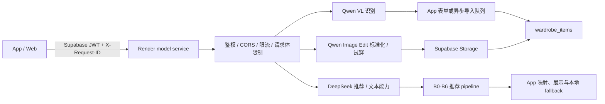

# 模型 Workflow 稳定性修复与线上验证记录（2026-08-05）

本文记录 2026-08-04～05 对 Stylee 模型链路进行的实际代码审计、线上复现、Render 日志归因、修复和回归验证。
结论来自真实页面、真实模型请求和运行日志，不以架构说明文档代替验证，也不描述模型不可见的内部思维链。

## 1. 结论摘要

| 链路 | 当前结论 | 证据等级 |
|---|---|---|
| 穿搭推荐 `/recommend` | 已确认根因、修复并在线上真实请求中恢复 | 已实测 |
| 请求追踪与超时归因 | App、model service 和上游模型元数据已可按 request ID 对齐 | 代码与测试已验证 |
| 手动添加/编辑的识别失败保护 | 失败结果不会覆盖表单或已有商品属性 | 代码与单测已验证 |
| 主入口“相册导入”的识别失败保护 | **仍未完整修复**：异步导入队列忽略 `meta.ok`，仍可能把 mock 单品自动入库 | 静态代码确认，P0 |
| 真实图片识别 | 修复后尚未重新上传图片做端到端验证 | 未验证 |
| 推荐 RAG | Render 缺少向量索引，线上持续降级为关键词检索 | 线上日志已确认，P1 |

因此，准确的发布结论是：**推荐稳定性修复已验证；识别失败保护只覆盖了部分入口，不能表述为“识别链路已全部修复”。**

## 2. 验证对象与版本

### 2.1 App/Web 仓库

- 仓库：[`yiguo2026/stylee_mvp_v2`](https://github.com/yiguo2026/stylee_mvp_v2)
- 分支：`main`
- 本轮功能修复后的基线：`0892e3f`
- 线上页面：`https://yiguo2026.github.io/`
- App 内 vendored model service：`model-service/`

### 2.2 线上 model service

- Render 实际部署源：[`fitzw/style-model`](https://github.com/fitzw/style-model)
- 本轮部署版本：`627e8e3`
- 服务地址：`https://stylee-model-service.onrender.com`
- App 仓库中的 `model-service/` 不是 Render 的直接部署源；服务端改动必须同步到两个仓库并执行同步检查。

### 2.3 本轮证据

- 登录后的线上 Web 页面真实操作。
- 浏览器网络状态、控制台错误与页面耗时。
- Render Application Logs 中的 `stylee_request`、`stylee_upstream_response` 和 usage 日志。
- App、model service 当前代码的逐入口调用追踪。
- model service 离线测试、App 契约测试、`npm run check`、Web 构建和 vendored service 同步检查。

## 3. 当前真实架构链路



### 3.1 识别与相册导入

主入口“相册导入”的实际路径是：

1. `AddClothingSheet` 选择一张或多张图片，调用 `importStore.startImport()`。
2. `importStore.handleDetection()` 调用 `aiDetectMultiItems()`。
3. `aiDetectMultiItems()` 先请求 `/recognize-multi`：
   - App 等待上限 60 秒；
   - model service 上游等待上限 50 秒；
   - 模型为 Qwen VL。
4. 多品识别无结果时，客户端串行降级到 `aiRecognizeClothing()`，请求 `/recognize`：
   - App 等待上限 20 秒；
   - model service 上游等待上限 15 秒。
5. 单品识别仍无结果时，`aiRecognizeClothing()` 调用 `mockRecognizeClothing()`，返回随机属性，同时将 `meta.ok` 标记为 `false`。
6. 当前 `importStore.handleDetection()` 只读取 `result.items`，没有检查 `result.meta.ok`。只要 mock 返回 1 件，队列就继续执行：
   - `/standardize`；
   - 上传标准图或原图；
   - `addItem()` 自动写入 `wardrobe_items`。

这说明原始“随机识别结果自动入库”问题在主相册入口仍有代码路径，不应被视为完全关闭。

手动添加页和编辑页的路径不同：两处已通过 `shouldApplyRecognition(meta.ok, itemCount)` 拦截失败结果；手动添加还必须由用户点击保存后才写库。

### 3.2 图片标准化

1. App 请求 `/standardize`，整体等待上限 90 秒。
2. model service 顺序执行 Qwen Image Edit，默认上限 60 秒。
3. 图片生成后再执行 Qwen VL 视觉回验，默认上限 20 秒。
4. 回验成功后，App 将上游临时图片复制到 Supabase Storage。
5. 标准化失败时，当前导入队列允许回退到原图继续保存。

该 fallback 可以保证导入可用，但必须建立在识别属性可信的前提上；不能与随机 mock 属性组合后自动入库。

### 3.3 穿搭推荐

1. 结果页读取用户衣橱、风格偏好、天气、文本或筛选标签。
2. App 请求 `/recommend`，客户端等待上限 90 秒。
3. model service 执行鉴权、限流并创建 request trace。
4. 推荐 pipeline 顺序执行：
   - B0：DeepSeek 解析自然语言意图；
   - B1：代码构造季节、槽位和衣橱候选池；
   - B2：检索 Garments2Look 审美范例；
   - B3：DeepSeek 生成候选搭配；
   - B4：代码做硬约束校验和四维评分；
   - B5：代码去重并保证多样性；
   - B6：代码生成置信度。
5. App 将 service 响应映射到衣橱单品并展示。
6. service 失败时：
   - 空或稀疏衣橱使用 `buildFallbackLook()`；
   - 其他情况使用本地 mock 推荐；
   - request ID、失败阶段和错误类型会保留在错误元信息中。

推荐额度目前在发起模型请求前由客户端 `AsyncStorage` 扣除，因此 service 失败后展示 fallback 仍会消耗一次额度。这是当前已确认但未修复的产品/计费语义问题。

### 3.4 试穿与 Gamma

- 生产试穿同时请求 `/tryon-image` 和 `/tryon-suggestion`：Qwen Image Edit 生成图片，DeepSeek 生成建议。
- App 的试穿图请求上限为 120 秒；试穿额度同样在请求前由客户端扣除。
- Gamma 是独立实验路径：`/gamma/import`、`/gamma/outfit`、`/gamma/tryon`，不替代上述生产链路。

## 4. 推荐失败的真实归因

### 4.1 首次页面现象

- 首次真实页面测试中，`/recommend` 约 69 秒后返回 500，页面约 83 秒展示本地 fallback。
- 当时尚未部署分阶段 trace，69 秒可能同时包含 Render 冷启动、服务执行和页面 fallback 等待，不能仅凭该数字判断是“模型慢”还是“请求超时”。
- 该次请求只能证明 service 最终失败，不能提供足够的阶段归因。

### 4.2 加入 trace 后的复现

加入 request ID 和阶段耗时后，线上又复现两次 502：

| 请求 | 总耗时 | B0 | B3 | 失败阶段 | 错误 |
|---|---:|---:|---:|---|---|
| 复现 1 | 21.239 秒 | 4.826 秒 | 15.689 秒 | `B3.generate_outfits` | `JSONDecodeError` |
| 复现 2 | 16.041 秒 | 1.809 秒 | 14.232 秒 | `B3.generate_outfits` | `JSONDecodeError` |

第三次复现的完整上游证据：

| 字段 | 值 |
|---|---:|
| request ID | `stylee-msene5x8-8ams9r8k` |
| HTTP 状态 | 502 |
| service 总耗时 | 20.998 秒 |
| B0 | 2.107 秒 |
| B3 | 18.250 秒 |
| `finish_reason` | `length` |
| 正文长度 | 0 字符 |
| 推理内容长度 | 6901 字符 |
| completion tokens | 2048 |
| 最终错误 | `JSONDecodeError: Expecting value: line 1 column 1` |

### 4.3 根因

这不是网络超时，也不是 60 秒服务端 deadline 被触发。真实执行过程是：

1. DeepSeek 的 B3 HTTP 请求成功返回。
2. 请求未显式关闭 thinking，模型把 2048 个输出 token 全部用于推理内容。
3. `finish_reason=length`，可供业务解析的 `message.content` 为空。
4. provider 对空字符串执行 JSON 解析，在第一个字符失败。
5. model service 将该异常归因为 B3 的 502；App 随后展示本地 fallback。

长耗时主要来自 B0、B3 两次串行模型调用，其中失败请求的 B3 单次占 14～18 秒。增加客户端超时只能让用户等得更久，不能解决空正文问题。

## 5. 已实施改动

### 5.1 App/Web 仓库提交

| Commit | 改动 | 作用 |
|---|---|---|
| [`7b9d09c`](https://github.com/yiguo2026/stylee_mvp_v2/commit/7b9d09c) | 请求追踪、阶段耗时、超时归因和错误契约 | 区分客户端中止、上游超时、HTTP 失败和具体 pipeline 阶段 |
| [`7aeb444`](https://github.com/yiguo2026/stylee_mvp_v2/commit/7aeb444) | 上游响应安全元数据日志 | 记录 `finish_reason`、正文/推理长度和 token，不记录原始内容 |
| [`4a23832`](https://github.com/yiguo2026/stylee_mvp_v2/commit/4a23832) | DeepSeek 结构化请求默认关闭 thinking | 防止推理内容耗尽 JSON 输出额度 |
| [`0892e3f`](https://github.com/yiguo2026/stylee_mvp_v2/commit/0892e3f) | 手动添加和编辑页拦截失败识别结果 | 防止失败结果覆盖表单或已有商品；**未覆盖异步相册导入队列** |

### 5.2 Canonical model service 提交

| Commit | 对应改动 |
|---|---|
| [`0ce298f`](https://github.com/fitzw/style-model/commit/0ce298f) | request ID、阶段 trace、服务端 timeout 与错误分类 |
| [`b0e7644`](https://github.com/fitzw/style-model/commit/b0e7644) | 上游安全响应元数据 |
| [`627e8e3`](https://github.com/fitzw/style-model/commit/627e8e3) | DeepSeek thinking 默认关闭，已由 Render 部署 |

### 5.3 日志字段

每个 model service 请求输出一条 `stylee_request`：

- `request_id`、`feature`、`path`、HTTP 状态和总耗时；
- `stage_ms`：例如 `B0.parse_intent`、`B3.generate_outfits`；
- `provider`、模型名和上游 timeout；
- `degraded`、fallback 阶段和原因；
- 失败阶段、异常类型和可重试标记。

每次 DeepSeek/Qwen-compatible 响应输出一条 `stylee_upstream_response`：

- provider、feature、model 和上游 response ID；
- `finish_reason`；
- 正文字符数、推理字符数；
- prompt、completion 和 total token。

日志刻意不记录原始 prompt、模型正文、推理原文、用户图片或 API key。

## 6. 修复后的线上验证

Render 部署 `627e8e3` 后，使用同一线上页面重新发起真实推荐：

| 指标 | 修复前 | 修复后 |
|---|---:|---:|
| HTTP 状态 | 502 | 200 |
| service 总耗时 | 20.998 秒 | 9.112 秒 |
| 页面显示耗时 | fallback 前更长 | 9.5 秒 |
| B0 | 2.107 秒 | 1.405 秒 |
| B3 | 18.250 秒 | 6.854 秒 |
| B3 `finish_reason` | `length` | `stop` |
| B3 正文长度 | 0 | 2695 字符 |
| B3 推理长度 | 6901 字符 | 0 |
| B3 completion tokens | 2048 | 1233 |
| 结果 | JSON 解析失败 | 返回真实搭配 |

修复后 request ID 为 `stylee-msenkn96-yl6k5eml`。页面展示 4 件真实衣橱单品，并明确标记 `model-service/deepseek · 9.5s`。

该结果证明本次失败根因已经被处理，但单次成功不足以代表稳定 p95；仍需持续采样。

## 7. 识别失败与 fallback 评估

### 7.1 修复前真实现象

- 浏览器在 `07:07:33` 记录 `/recognize-multi` 的 `AbortError`。
- `07:07:53` 又记录 `/recognize` 的 `AbortError`，两条日志间隔约 20 秒。
- 结合代码中的 60 秒和 20 秒客户端 deadline，可确认客户端先等待多品识别，再串行等待单品识别。
- 两次请求失败后，随机 mock 生成“棕色复古包 / 棕色 / 皮革”，随后异步导入队列将它写入衣橱。
- 测试产生的错误数据已删除。

### 7.2 能确认与不能确认的根因

能确认：

- 用户实际等待了两段串行 deadline，而不是一次识别。
- 失败后客户端进入随机 mock，且状态型相册导入流程继续自动保存。
- 这种 fallback 对持久化业务不合理。

不能确认：

- 当时 Qwen VL 是纯粹推理过慢、上游无响应、网络链路阻塞，还是服务端已经失败但客户端没有及时收到错误。
- 原因是该次线上测试发生在 request ID、服务端阶段 trace 和上游 timeout 归因部署之前，没有可对齐的 Render 日志。

当前服务端已经将单品/多品上游 deadline 收紧为 15 秒/50 秒，短于客户端 20 秒/60 秒。后续同类失败应由服务端先返回 504，并通过 request ID 判断停在 `A1.vision_recognize` 还是 `A1.multi_vision_recognize`。但修复后尚未重新上传真实图片，因此不能把具体 Qwen 根因写成已确认。

### 7.3 当前 fallback 是否合理

- 失败后保留原属性、允许重试或手动填写：合理。
- 标准化失败后保留原图：合理，但应明确标记降级。
- 模型失败后生成随机识别属性，仅用于无状态 UI 演示：内部测试阶段可接受。
- 随机属性覆盖用户数据或自动写入数据库：不合理，生产链路必须禁止。
- 当前手动添加/编辑已禁止应用失败结果，但主相册导入仍未检查 `meta.ok`，因此整体状态仍不合格。

## 8. RAG 质量降级

线上每次推荐均出现：

```text
[rag] 索引不可用: data/garments2look/index.meta.json -> 回退关键词 stub
```

实际原因不是检索计算慢，而是 Render 的 canonical `fitzw/style-model` 仓库没有跟踪 `data/garments2look/` 索引文件；Docker `COPY . /app` 无法复制不存在于部署源中的文件。

影响：

- `/recommend` 仍可用，不会因此返回错误；
- B2 只使用少量静态关键词范例，无法获得向量检索的风格相似性；
- 稳定性修复后的真实搭配可以评估基本合法性，但不代表完整 RAG 搭配质量。

## 9. 验证清单

本轮已执行并通过：

- model service provider HTTP 与响应解析测试；
- request trace、service 路由、RAG 降级和 vision timeout 测试；
- App service 契约、映射和识别策略测试；
- `npm run check`；
- `npm run build:web`；
- `git diff --check`；
- App vendored `model-service/` 与 canonical `fitzw/style-model` 同步检查；
- Render 真实部署和 `/recommend` 线上登录态测试；
- GitHub Pages Deploy Web run `30911429906`。

未完成：

- 修复后真实图片的 `/recognize-multi`、`/recognize`、`/standardize` 端到端复测；
- 推荐与识别的 p50、p95 长期样本；
- iOS 真机链路；
- RAG vector 模式线上验证。

## 10. 剩余问题与优先级

| 优先级 | 问题 | 风险 | 建议动作 |
|---|---|---|---|
| P0 | `importStore.handleDetection()` 忽略 `meta.ok` | 模型失败后 mock 属性仍可能自动入库 | 失败或空结果直接标记任务失败，不进入标准化和 `addItem()` |
| P1 | Render 缺少 RAG 索引 | 推荐可用但搭配审美质量降级 | 将生产索引随 canonical repo/镜像发布，或从受控对象存储加载并校验 signature |
| P1 | 推荐/试穿额度在请求成功前扣除 | service 失败或 timeout 仍消耗额度 | 服务端成功后原子计费；失败请求不扣或自动返还 |
| P1 | 识别修复后未做真实图片复测 | 无法确认 Qwen 慢、网络阻塞或其他上游问题 | 使用非敏感测试图，按 request ID 对齐浏览器与 Render 日志且不写库 |
| P2 | 仅有少量推荐耗时样本 | 9.1 秒不能代表 p95 | 按 feature、stage、provider 聚合 p50/p95 和错误率 |
| P2 | App 仓库与 canonical service 双份代码 | 易出现已改 App、未部署 Render 的漂移 | CI 强制执行 model-service sync check |

## 11. 发布判断

- **推荐修复：通过。** 根因、代码改动、部署版本和线上 200 结果可以互相印证。
- **日志与归因：通过。** 后续可以区分客户端 timeout、服务端 deadline、模型空正文和解析失败。
- **识别稳定性：条件不通过。** 现有保护没有覆盖主相册导入队列，且修复后真实图片尚未复测。
- **搭配质量：条件通过。** 硬约束链路生效，但 RAG 仍处于关键词降级模式，不能视为最终质量状态。

在关闭 P0 识别自动入库缺口前，不应再次对外使用“模型识别链路已全部修复”的表述。
