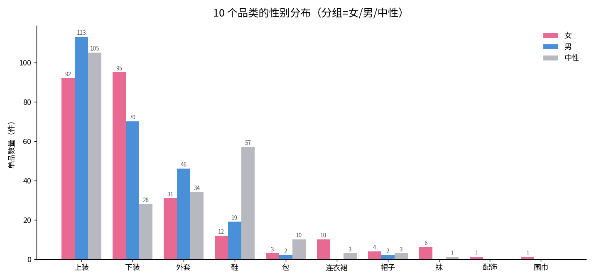
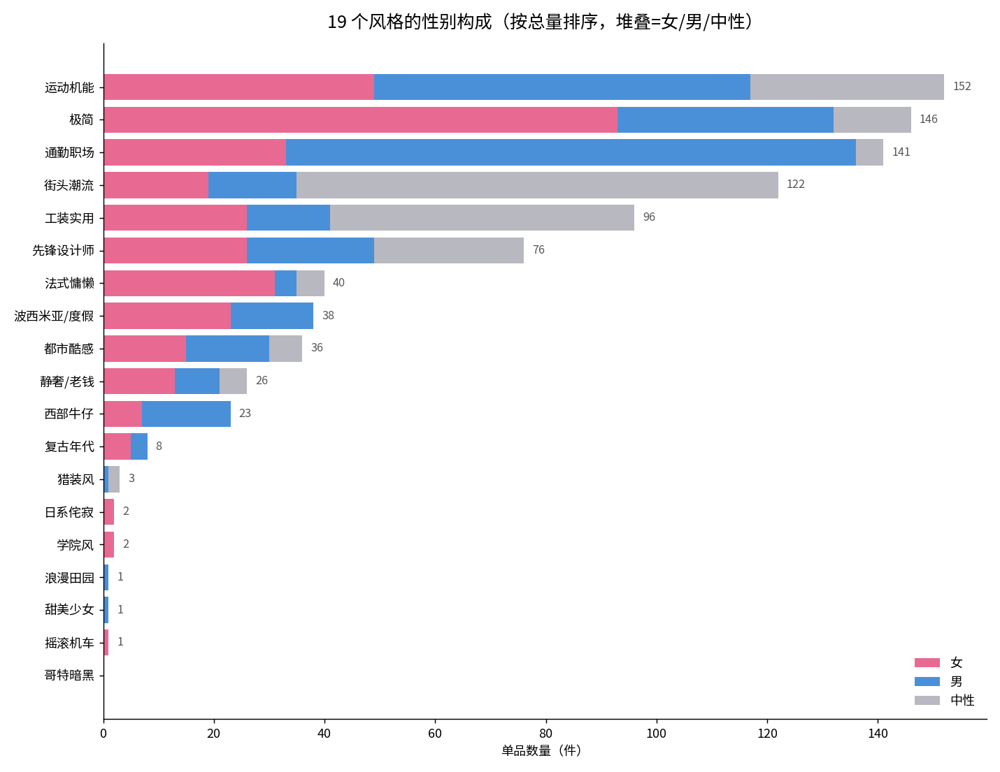

<callout icon="bulb" bgc="3">  
- **整体均衡，不用担心总量偏科：** 748 件单品中女 255 / 男 252 / 中性 241；算上中性共享后，女生实际可用 496 件、男生 493 件，差距仅 3 件。  
- **失衡藏在风格层，且方向与直觉相反：** 通勤职场严重偏男（女 33 : 男 103），女性职场刚需反而是全库最大的性别缺口。  
- **男生在"柔性风格"上近乎空白：** 法式慵懒男款仅 4 件、极简男 39（女 93）、波西米亚男 15（女 23），男生想走温柔/松弛路线基本无料可搭。  
- **7 个风格几乎无货（≤3 件），部分还标错性别：** 甜美少女、浪漫田园仅有的 1 件都被标成"男"，女生这两类目前完全生成不出，疑似打标错误 + 供给近零。  
- **中性款掩盖了专属款的薄弱：** 街头（中性 87）、工装（中性 55）、鞋（中性 57）靠中性撑起可用量，男女各自的专属款其实很少。  
</callout>

上一轮已确认整体性别配比是均衡的。这份文档把性别继续拆到**品类、风格、季节**三个维度，定位到"具体哪个性别、哪个风格、缺哪个品类"，作为定向补货的依据。

## 数据源与口径

- **数据源：** `model-service/eval/catalog.json`，Stylee 当前线上单品池全量 748 件。
- **口径：**
  - 性别取单品自带 `gender` 字段（女 / 男 / 中性三类）。
  - "实际可用量"= 该性别专属款 + 中性款（中性款男女都能搭），因此女生可用与男生可用会共享中性款，两者不可相加。
  - 风格归属基于 `name + style_tags` 关键词/别名模糊匹配到 19 个规范风格；一件单品可命中多个风格，故风格总量之和大于 748。
  - 夏季可用= `season` 含"夏"的单品。
- **已知瑕疵：** 风格匹配为关键词近似，与严格标注口径存在 1–4 件的小幅偏差（例如"街头潮流"本次 122、先前口径 126）；`甜美少女`/`浪漫田园`仅各 1 件且性别标注存疑，属数据质量问题而非真实供给。

## 整体性别：均衡

<table header-row="true" header-col="false" col-widths="160,120,120,160">  
  <tr>  
    <td>口径</td>  
    <td>女</td>  
    <td>男</td>  
    <td>中性</td>  
  </tr>  
  <tr>  
    <td>专属款数量</td>  
    <td>255（34.1%）</td>  
    <td>252（33.7%）</td>  
    <td>241（32.2%）</td>  
  </tr>  
  <tr>  
    <td>实际可用（含中性）</td>  
    <td>496</td>  
    <td>493</td>  
    <td>—</td>  
  </tr>  
</table>

三档几乎三等分，含中性共享后女男可用量差 3 件。**总量层面没有性别偏向，问题都在结构里。**

## 品类维度：裙装/配饰偏女，外套偏男

- **下装偏女**（女 95 : 男 70）、**外套偏男**（男 46 : 女 31），属正常穿着差异，影响不大。
- **连衣裙、袜、配饰、围巾几乎是纯女品类**：连衣裙女生可用 13、男生仅 3；配饰全库仅 1 件、围巾仅 1 件、袜 7 件。配饰类整体薄弱，男女搭配的"点缀/收尾"环节都缺料。
- **鞋高度依赖中性款**（88 件里中性 57），男女专属鞋款各只有 12 / 19 件，风格化搭配（如甜美、摇滚）时鞋的可选性会受限。

## 风格维度：真正的失衡都在这里

风格层出现三类结构性问题，比品类层严重得多。

### 通勤职场：女性刚需，却严重偏男

<table header-row="true" header-col="false" col-widths="140,90,90,90,110,110">  
  <tr>  
    <td>风格</td>  
    <td>女</td>  
    <td>男</td>  
    <td>中性</td>  
    <td>女生可用</td>  
    <td>男生可用</td>  
  </tr>  
  <tr>  
    <td>通勤职场</td>  
    <td>33</td>  
    <td>103</td>  
    <td>5</td>  
    <td>38</td>  
    <td>108</td>  
  </tr>  
  <tr>  
    <td>极简</td>  
    <td>93</td>  
    <td>39</td>  
    <td>14</td>  
    <td>107</td>  
    <td>53</td>  
  </tr>  
  <tr>  
    <td>法式慵懒</td>  
    <td>31</td>  
    <td>4</td>  
    <td>5</td>  
    <td>36</td>  
    <td>9</td>  
  </tr>  
  <tr>  
    <td>波西米亚/度假</td>  
    <td>23</td>  
    <td>15</td>  
    <td>0</td>  
    <td>23</td>  
    <td>15</td>  
  </tr>  
</table>

通勤职场是女性用户的高频刚需场景，但女款只有 33 件、可用 38 件，不到男生（108）的四成。这是全库方向最反直觉、也最该优先补的缺口。反过来，男生在**法式慵懒（可用 9）、极简（可用 53，仅女生一半）、波西米亚（可用 15）**这些"柔性/松弛"风格上供给明显不足，想走温柔路线基本搭不出。

### 中性款撑起的"伪均衡"

<table header-row="true" header-col="false" col-widths="140,90,90,110,140">  
  <tr>  
    <td>风格</td>  
    <td>女</td>  
    <td>男</td>  
    <td>中性</td>  
    <td>偏向判定</td>  
  </tr>  
  <tr>  
    <td>街头潮流</td>  
    <td>19</td>  
    <td>16</td>  
    <td>87</td>  
    <td>均衡（靠中性）</td>  
  </tr>  
  <tr>  
    <td>工装实用</td>  
    <td>26</td>  
    <td>15</td>  
    <td>55</td>  
    <td>均衡（靠中性）</td>  
  </tr>  
  <tr>  
    <td>先锋设计师</td>  
    <td>26</td>  
    <td>23</td>  
    <td>27</td>  
    <td>均衡</td>  
  </tr>  
  <tr>  
    <td>都市酷感</td>  
    <td>15</td>  
    <td>15</td>  
    <td>6</td>  
    <td>均衡</td>  
  </tr>  
</table>

这几个风格看起来男女都够用，但街头、工装的可用量主要来自中性款（各 87、55 件）。一旦搭配需要明确性别版型（如女生街头的短款、男生工装的宽松裤型），实际可选空间会大幅收窄。

### 几乎无货 + 疑似标错性别的 7 个风格

<table header-row="true" header-col="false" col-widths="140,80,80,80,220">  
  <tr>  
    <td>风格</td>  
    <td>女</td>  
    <td>男</td>  
    <td>总量</td>  
    <td>问题</td>  
  </tr>  
  <tr>  
    <td>哥特暗黑</td>  
    <td>0</td>  
    <td>0</td>  
    <td>0</td>  
    <td>全库无货，男女都生成不出</td>  
  </tr>  
  <tr>  
    <td>甜美少女</td>  
    <td>0</td>  
    <td>1</td>  
    <td>1</td>  
    <td>典型女性风格，仅有的 1 件却标"男"，女生无法生成</td>  
  </tr>  
  <tr>  
    <td>浪漫田园</td>  
    <td>0</td>  
    <td>1</td>  
    <td>1</td>  
    <td>同上，仅 1 件且标"男"，疑似打标错误</td>  
  </tr>  
  <tr>  
    <td>摇滚机车</td>  
    <td>1</td>  
    <td>0</td>  
    <td>1</td>  
    <td>仅 1 件女款</td>  
  </tr>  
  <tr>  
    <td>学院风</td>  
    <td>2</td>  
    <td>0</td>  
    <td>2</td>  
    <td>仅女款，男生无货</td>  
  </tr>  
  <tr>  
    <td>日系侘寂</td>  
    <td>2</td>  
    <td>0</td>  
    <td>2</td>  
    <td>仅女款，男生无货</td>  
  </tr>  
  <tr>  
    <td>猎装风</td>  
    <td>0</td>  
    <td>1</td>  
    <td>3</td>  
    <td>2 件中性 + 1 件男，女生几乎无专属款</td>  
  </tr>  
</table>

这 7 个风格无论哪个性别都基本搭不出完整 look。其中**甜美少女、浪漫田园**是明显的女性向风格，仅有的单品却标成男性，属于数据质量问题——建议优先核对标注，再谈补货。

## 季节维度：夏季通勤是双向盲区

- **通勤职场夏装几乎为零**：夏季女生可用 4 件、男生 0 件。夏季通勤是使用高峰，目前男女都无法生成合适搭配。
- **夏季供给集中在街头与运动**：街头夏季女 61 / 男 57，运动机能夏季女 32 / 男 46，夏季搭配容易同质化。
- **偏女风格的夏装尚可**：法式（夏女 12）、波西米亚（夏女 11）夏季可用度还行，男生对应的夏装则很少。

## 补货行动清单

按"缺口严重度 × 是否刚需"排序，优先级从上到下：

<table header-row="true" header-col="false" col-widths="150,120,320,120">  
  <tr>  
    <td>缺口</td>  
    <td>性别</td>  
    <td>建议动作</td>  
    <td>优先级</td>  
  </tr>  
  <tr>  
    <td>通勤职场</td>  
    <td>女</td>  
    <td>补女性职场单品（西装、衬衫、直筒裤、乐福鞋），目标可用量从 38 提到男生同等水平；优先补夏装</td>  
    <td>P0</td>  
  </tr>  
  <tr>  
    <td>甜美少女 / 浪漫田园</td>  
    <td>女</td>  
    <td>先核对现有 2 件的性别标注（疑似标错），再补女款；这两类目前女生零可用</td>  
    <td>P0</td>  
  </tr>  
  <tr>  
    <td>法式慵懒 / 极简 / 波西米亚</td>  
    <td>男</td>  
    <td>补男性柔性风格单品（针织、宽松衬衫、休闲西装），补齐"温柔/松弛"路线</td>  
    <td>P1</td>  
  </tr>  
  <tr>  
    <td>哥特暗黑 / 摇滚 / 学院 / 日系 / 猎装</td>  
    <td>男女</td>  
    <td>小众风格整体扩容，每风格至少凑齐一套完整 look 的上/下/鞋</td>  
    <td>P1</td>  
  </tr>  
  <tr>  
    <td>配饰 / 围巾 / 帽 / 包</td>  
    <td>男女</td>  
    <td>配饰品类整体薄弱（配饰 1、围巾 1），补点缀类单品提升搭配完成度</td>  
    <td>P2</td>  
  </tr>  
  <tr>  
    <td>夏季通勤</td>  
    <td>男女</td>  
    <td>专项补夏季通勤（短袖衬衫、薄西装、透气长裤），覆盖使用高峰</td>  
    <td>P2</td>  
  </tr>  
</table>
